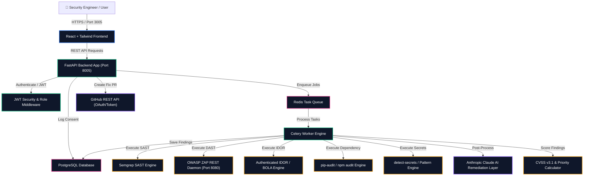
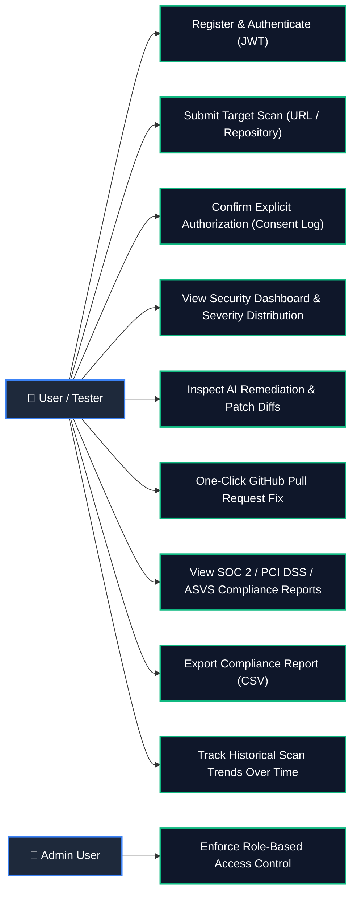
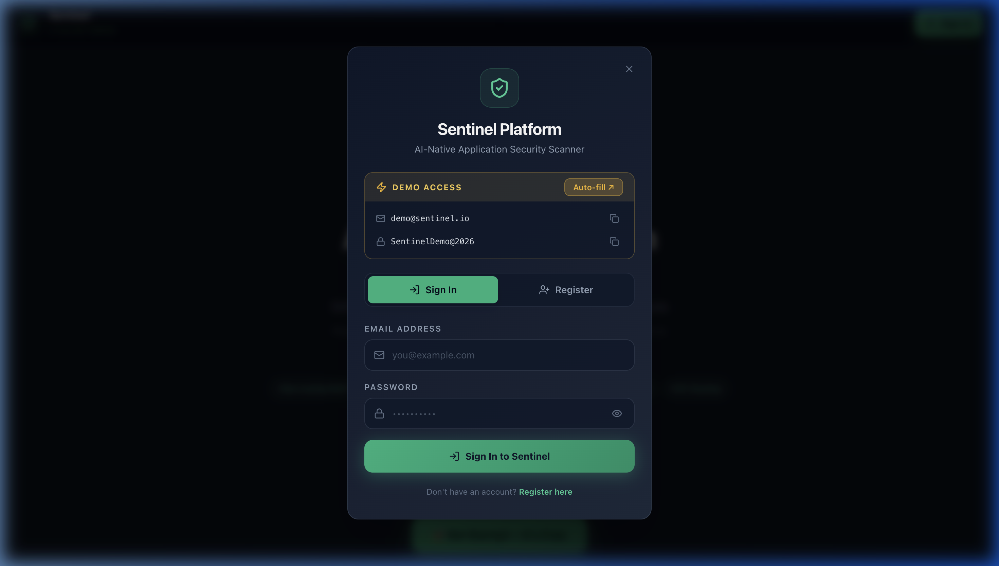

# Sentinel: AI-Native Application Security Platform

**Sentinel** is an automated application security scanning platform. It helps software developers and security teams find, evaluate, and fix security vulnerabilities in source code and web applications. 

By combining multiple scanning tools (static code analysis, dynamic web application testing, secret detection, dependency auditing, and access control testing) with AI-assisted analysis, Sentinel filters out false alarms, explains security issues in simple language, and automatically generates ready-to-merge code fixes directly as GitHub Pull Requests.

Live URL- https://sentinel-application.netlify.app/

### 📄 Product Requirements Document (PRD)
Sentinel's core functionality, architecture decisions, and target user personas are outlined in detail within the official PRD. This document breaks down the specific security problems the platform aims to solve, how it uses AI to filter noise, and the project's overall scope.
[👉 Click here to view the full Sentinel PRD (PDF)](docs/Sentinel_PRD.pdf)
---

## 🏛️ System Architecture Diagram



---

## 🎯 Use-Case Workflow Diagram



---

## 🌟 What Sentinel Does (Core Features)

1. **Multi-Engine Security Scanning**:
   - **Static Code Analysis (SAST)**: Scans source code files for known bugs, security flaws, and unsafe coding patterns using Semgrep.
   - **Dynamic App Testing (DAST)**: Tests running web servers and endpoints for active vulnerabilities using OWASP ZAP.
   - **Authorization & IDOR Testing**: Automatically verifies if logged-in users can access or tamper with data belonging to other accounts.
   - **Dependency Vulnerability Auditing**: Checks project packages (`pip-audit`, `npm audit`) against official security databases (CVEs).
   - **Secret Leak Detection**: Searches code for accidentally committed API keys, database credentials, and private tokens.

2. **AI Analysis & Automated Fixes**:
   - Uses Anthropic Claude to review security findings alongside surrounding source code context.
   - Explains what each vulnerability means in clear, plain language and provides step-by-step exploit scenarios.
   - Automatically generates code fixes (patch diffs) that developers can review.
   - Filters low-confidence alerts so developers can focus on real, confirmed threats.

3. **CVSS v3.1 Priority Ranking**:
   - Calculates official standard severity scores (CVSS v3.1) for every issue.
   - Multiplies severity by AI confidence ratings to rank the most critical bugs first.

4. **One-Click GitHub Pull Requests**:
   - Automatically opens a new branch and Pull Request on GitHub with the AI-suggested code fix applied.

5. **Compliance Mapping & CSV Exports**:
   - Maps vulnerabilities directly to **SOC 2**, **PCI DSS v4.0**, and **OWASP ASVS v4.0** compliance requirements.
   - Generates downloadable CSV compliance reports for security audits.

6. **Historical Security Tracking**:
   - Tracks security improvements, remaining vulnerabilities, and average risk ratings over time across multiple scans.

7. **Safety & Explicit Authorization Gate**:
   - Requires explicit permission confirmation (`"authorized": true`) before scanning any target.
   - Logs all target authorization requests into a secure PostgreSQL `consent_log` table.

---

## 📸 Interface Screenshots & Demo Recording

### Sentinel Application Walkthrough Demo (Recorded Session)
[🎥 Watch the Sentinel Application Walkthrough Demo](https://github.com/SatyamPandey07/Application-Security-Scanner/blob/main/docs/assets/sentinel_demo_walkthrough.webm)

### Sentinel Authentication & Sign In/Up Landing Modal


---

## ⚙️ Technology Stack

| Component | Technology |
| :--- | :--- |
| **Backend Framework** | Python 3.12, FastAPI, Uvicorn |
| **Database & ORM** | PostgreSQL 16, SQLAlchemy 2.0, Alembic |
| **Task Queue** | Celery 5.3, Redis 7 |
| **Frontend UI** | React 18, Vite 5, Tailwind CSS, Lucide React Icons |
| **SAST Engine** | Semgrep CLI (`p/security-audit` ruleset) |
| **DAST Engine** | OWASP ZAP (`ghcr.io/zaproxy/zaproxy:stable`) |
| **Dependency & Secrets** | `pip-audit`, `detect-secrets`, Regex Entropy Matchers |
| **AI Remediation** | Anthropic Claude API (`claude-3-haiku-20240307`) |
| **Scoring Spec** | CVSS v3.1 Base Score Calculator |
| **VCS Integration** | GitHub REST API (Branching, Patch Commits, Pull Requests) |

---

## 🚀 Step-by-Step Local Setup & Execution Guide

### 1. Prerequisites
- Python 3.12+
- Node.js 18+
- Docker & Docker Compose

### 2. Launch with Docker Compose (Recommended)
```bash
docker-compose -f docker-compose.prod.yml up -d
```
Access the application services at:
- **Frontend UI**: `http://localhost:3005`
- **FastAPI REST API**: `http://localhost:8005/docs`
- **OWASP ZAP Daemon**: `http://localhost:8080`

### 3. Local Development Setup
```bash
# 1. Clone Repository
git clone https://github.com/SatyamPandey07/Application-Security-Scanner.git
cd Application-Security-Scanner

# 2. Setup Backend Virtual Environment & Database
cd backend
python3 -m venv venv
source venv/bin/activate
pip install -r requirements.txt
alembic upgrade head
python scripts/seed.py

# 3. Launch Backend API Server
uvicorn app.main:app --host 0.0.0.0 --port 8005

# 4. Launch Frontend UI (in separate terminal)
cd ../frontend
npm install
npm run dev -- --host --port 3005
```

---

## 🧪 Automated Testing Suite

Execute the backend test suite covering all unit test modules:

```bash
cd backend
pytest
```

---

## 📖 Production Deployment & Hardening Documentation

For production deployment options (Docker Compose / Cloud), environment variable references, Celery worker sandbox security isolation, and self-hosting security checklists, see [DEPLOYMENT.md](file:///Users/satyampandey/Application-Security-Scanner/DEPLOYMENT.md).

---

## 📜 License

MIT License &copy; 2026 Sentinel Platform.
