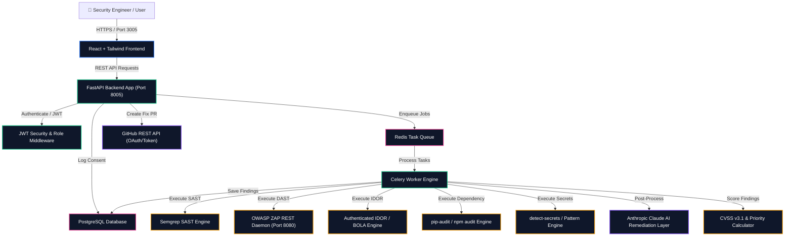
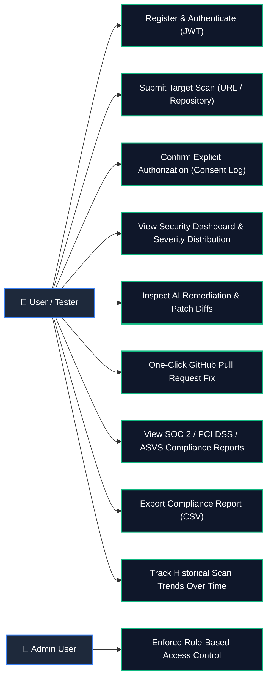

# Sentinel — AI-Native Application Security Platform

**Sentinel** is an autonomous, AI-native Application Security Scanner platform designed to eliminate false positives through correlated multi-engine security scanning, AI-powered remediation patch diffs, CVSS v3.1 prioritization, compliance mapping, and automated GitHub Pull Request creation.

---

## 🏛️ System Architecture Diagram



---

## 🎯 Use-Case Architecture Diagram



---

## 🌟 Comprehensive Feature Set

1. **Multi-Engine Correlated Security Scanning**:
   - **SAST**: Static Application Security Testing via Semgrep CLI (`p/security-audit` ruleset).
   - **DAST**: Dynamic Application Security Testing via containerized OWASP ZAP (spider + passive scanning).
   - **Authenticated IDOR / BOLA Engine**: Automated cross-account authorization verification using test credentials.
   - **Dependency Audit Engine**: Manifest auditing via `pip-audit` / `npm audit` against CVE databases.
   - **Secret Leak Detector**: Scanning for leaked API keys, tokens, and private keys via `detect-secrets` and high-entropy regex matchers.

2. **AI Remediation & Patch Generation Layer**:
   - Anthropic Claude integration evaluating findings against surrounding source code context (~20 lines).
   - Generates plain-English security explanations, step-by-step exploit scenarios, and unified git patch diff fixes.
   - Re-labels low-confidence alerts (`confirmed` vs `low_confidence`) without deleting findings.

3. **CVSS v3.1 & Weighted Priority Scoring**:
   - Computes pure CVSS v3.1 base scores verified against official FIRST.org spec test vectors.
   - Calculates weighted priority scores (`CVSS Base Score * AI Confidence`).

4. **Automated GitHub Pull Request Remediation**:
   - One-click GitHub PR creation applying AI-suggested patch diffs to new branches.
   - Content-drift validation handling target file modifications without force-pushing or corrupting repository state.

5. **Compliance Mapping & CSV Export**:
   - Maps security findings to **SOC 2**, **PCI DSS v4.0**, and **OWASP ASVS v4.0** control frameworks.
   - Downloadable CSV compliance reports for audit readiness.

6. **Historical Security Trend Analytics**:
   - Tracks vulnerability counts, confirmed findings, and average CVSS ratings over time for repeat target scans.

7. **Explicit Target Authorization & Consent Gate**:
   - Mandatory authorization confirmation field requirement on scan submissions (`"authorized": true`).
   - Logs all target consent actions into PostgreSQL `consent_log` table with user timestamps.

---

## 📸 Interface Screenshots

### Sentinel Platform Application Landing Page (E2E Test Recording)


### Sentinel Authentication & Registration Modal


---

## ⚙️ Technology Stack

| Component | Technology |
| :--- | :--- |
| **Backend Framework** | Python 3.12, FastAPI, Uvicorn |
| **Database & ORM** | PostgreSQL 16, SQLAlchemy 2.0, Alembic |
| **Task Queue** | Celery 5.3, Redis 7 |
| **Frontend UI** | React 18, Vite 5, Tailwind CSS, Lucide React Icons |
| **SAST Engine** | Semgrep CLI (`p/security-audit` ruleset) |
| **DAST Engine** | OWASP ZAP (`ghcr.io/zaproxy/zaproxy:stable`) |
| **Dependency & Secrets** | `pip-audit`, `detect-secrets`, Regex Entropy Matchers |
| **AI Remediation** | Anthropic Claude API (`claude-3-haiku-20240307`) |
| **Scoring Spec** | CVSS v3.1 Base Score Calculator |
| **VCS Integration** | GitHub REST API (Branching, Patch Commits, Pull Requests) |

---

## 🚀 Step-by-Step Local Setup & Execution Guide

### 1. Prerequisites
- Python 3.12+
- Node.js 18+
- Docker & Docker Compose

### 2. Launch with Docker Compose (Recommended)
```bash
docker-compose -f docker-compose.prod.yml up -d
```
Access the application services at:
- **Frontend UI**: `http://localhost:3005`
- **FastAPI REST API**: `http://localhost:8005/docs`
- **OWASP ZAP Daemon**: `http://localhost:8080`

### 3. Local Development Setup
```bash
# 1. Clone Repository
git clone https://github.com/SatyamPandey07/Application-Security-Scanner.git
cd Application-Security-Scanner

# 2. Setup Backend Virtual Environment & Database
cd backend
python3 -m venv venv
source venv/bin/activate
pip install -r requirements.txt
alembic upgrade head
python scripts/seed.py

# 3. Launch Backend API Server
uvicorn app.main:app --host 0.0.0.0 --port 8005

# 4. Launch Frontend UI (in separate terminal)
cd ../frontend
npm install
npm run dev -- --host --port 3005
```

---

## 🧪 Automated Testing Suite

Execute the 100% passing backend test suite covering all 29 unit test modules:

```bash
cd backend
pytest
```

---

## 📖 Production Deployment & Hardening Documentation

For complete production deployment options (Docker Compose / Cloud), environment variable references, Celery worker sandbox security isolation, and self-hosting security checklists, see [DEPLOYMENT.md](file:///Users/satyampandey/Application-Security-Scanner/DEPLOYMENT.md).

---

## 📜 License

MIT License &copy; 2026 Sentinel Platform.
